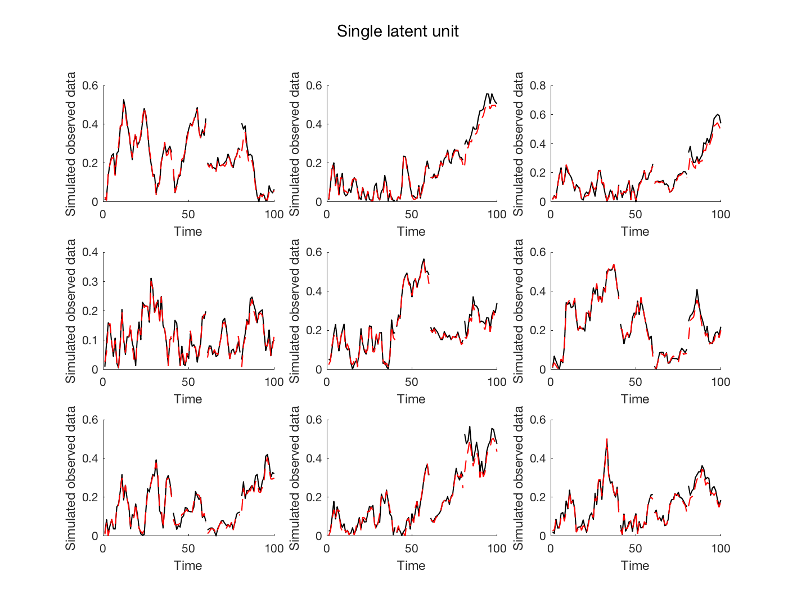
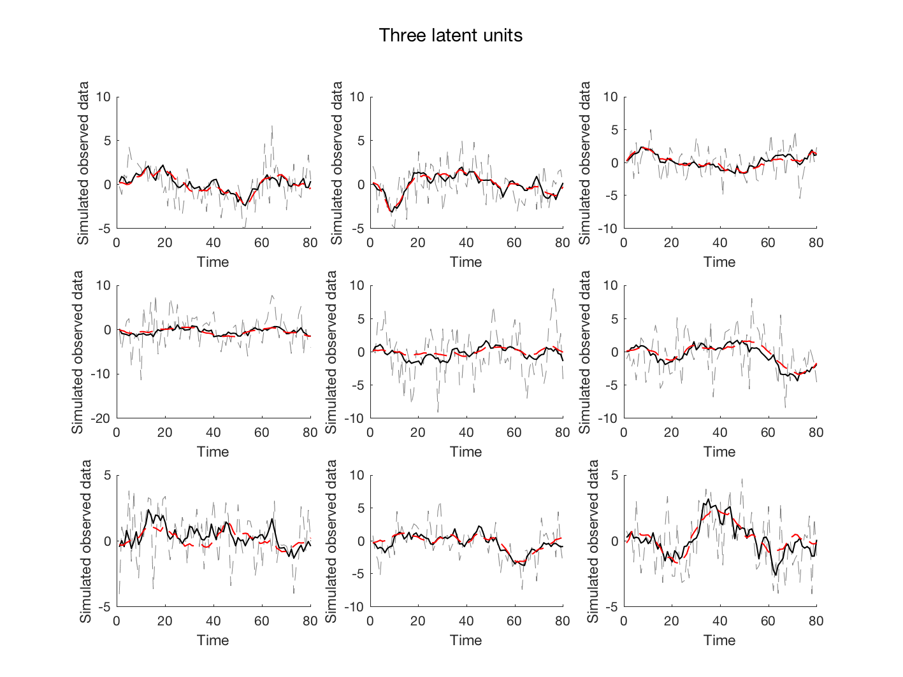
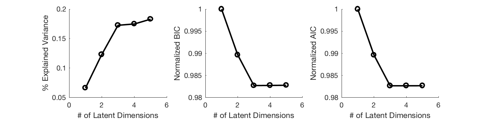
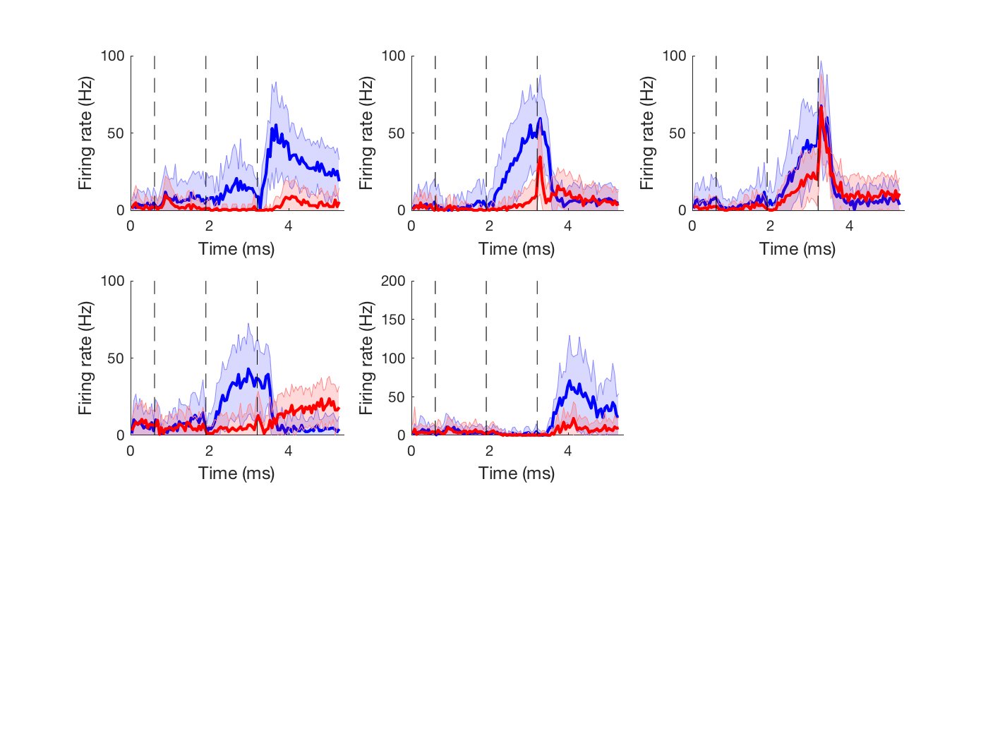
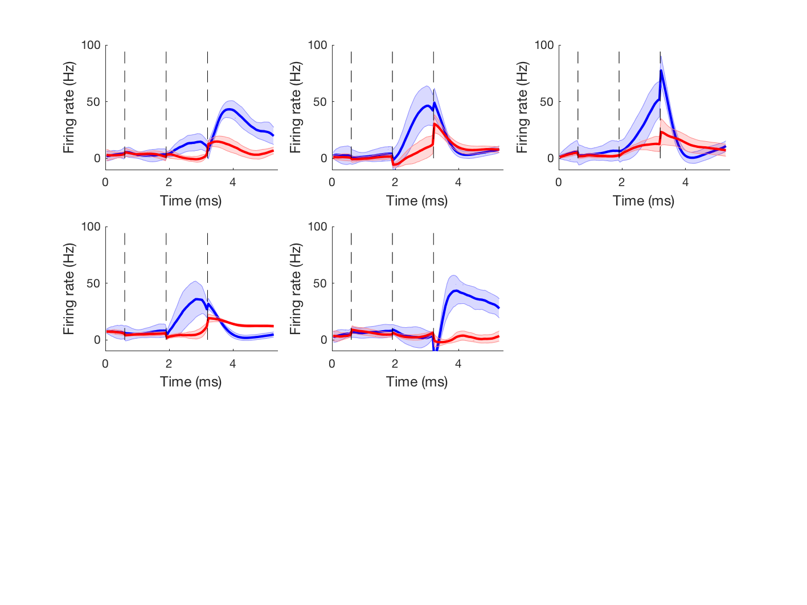

# Epoch-Dependent-LDS-Fit

Epoch dependent linear dynamics system fit

# About
This code of epoch-dependent linear dynamics system (EDLDS) fit, was originally developed and used to uncover the latent-space dynamics from the simultaneous recordings of frontal neural dynamics in [Wei et al. (2019)](https://www.nature.com/articles/s41467-018-08141-6).

# Folder structure

* [**Code**](Code) --- LDSI code version 3.0 (*Matlab*); Potentially changed to *Python* in later version.
* [**TestExamples-ArtificialData**](TestExamples-ArtificialData) --- A list of files used for tests of simulated neural system
* [**TestExamples-NeuralData**](TestExamples-NeuralData) -- A list of files used for fitting an exemplary simultaneous neural recording session

#TestExamples-ArtificialData Folder

## 1. Functions
* [SimulateLDS.m](TestExamples-ArtificialData/SimulateLDS.m) --- A code for simulated neural activity with single stage
* [SimulateLDS_MultiStage.m](TestExamples-ArtificialData/SimulateLDS_MultiStage.m) --- A code for simulated neural activity with multiple stage
* [stochastic.m](TestExamples-ArtificialData/stochastic.m) --- A code from SSID (subspace identification) for estimates of parameters

## 2. Testing files
* [Test_State_Variable.m](TestExamples-ArtificialData/Test_State_Variable.m) --- Test for goodness of fits for a **one-dimensional** latent variable system. For this case, one can in fact exam whether the fitted latent system is the similar to the original one. In plot, the black line stands for the original latent dynamics, and the red line stands for the fitted latent dynamics. In the default setting, there are 4 stages (and thus the breaking points are those between stages).

 * [Test_Arti_Neural_Data.m](TestExamples-ArtificialData/Test_Arti_Neural_Data.m) --- Test for goodness of fit for a __single stage one-dimensional__ latent variable system, where spike count is either generated by a Poisson (Part 1 of the code) or Log-normal (Part 2 of the code) process. Specifically,

	>
	>__Poisson spike count generation__
	>
	>Spike counts: Y(t) = Poiss(exp(Z(t)))
	>
	>Spike rate: Z(t) = Cx(t)
	>
	>Latent dynamics: x(t) = Ax(t-1) + w(t)

	>__Log-normal spike count generation__
	>
	>Spike counts: Y(t) = Round(exp(Z(t)))
	>
	>Spike rate: Z(t) = Cx(t) + v(t)
	>
	>Latent dynamics: x(t) = Ax(t-1) + w(t)

Here is an exemplary comparison between original and fitted latent neural dynamics using Log-normal after running this code.

* [Test_Arti_Neural_Data_Multiple_Latent_Variables.m](TestExamples-ArtificialData/Test_Arti_Neural_Data_Multiple_Latent_Variables.m) --- The same as [Test_Arti_Neural_Data.m](TestExamples-ArtificialData/Test_Arti_Neural_Data.m), expect it generates the data for multiple stages.

* [Test_Arti_Neural_Data_Percentage_Explained.m](TestExamples-ArtificialData/Test_Arti_Neural_Data_Percentage_Explained.m) --- The same as [Test_Arti_Neural_Data.m](TestExamples-ArtificialData/Test_Arti_Neural_Data.m), expect it generates the data from *multi-dimensional* latent variables (_xDim_ > 2) and __one stage__. Plots includes comparison of explained variance, BIC and AIC as fitted by different numbers of latent dimensions. Also the comparison of Y (grey lines), $Y_{exp}$ (red lines) and $Y_{est}$ (blue lines).

	>Simulated neural data: Y(t) = Cx(t) + v(t)
	>
	>Latent dynamics: x(t) = Ax(t-1) + w(t)
	>
	>Expectation of simulated neural data: $Y_{exp}$(t) = Cx(t)
	>
	>Estimation of neural data: $Y_{est}(t) = \bar{C} \bar{x}(t)$

# TestExamples-NeuralData
 [Test_Nuo_data_analysis_LDS.m](TestExamples-NeuralData/Test_Nuo_data_analysis_LDS.m) ---  Example fits using data [ANM219033_20131116.mat](TestExamples-NeuralData/ANM219033_20131116.mat) (which is already preprocessed).
 * original data

 * fitted data using EDLDS model

# License

MIT

# Citation

[Wei et al. (2019)](https://www.nature.com/articles/s41467-018-08141-6): An orderly single-trial organization of population dynamics in premotor cortex predicts behavioral variability. Nature Communications 10, 216 (2019).
